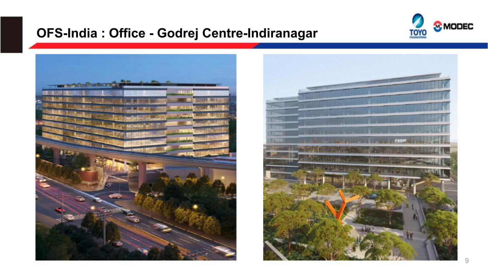
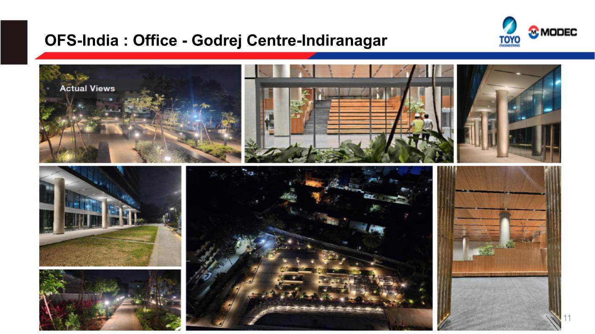
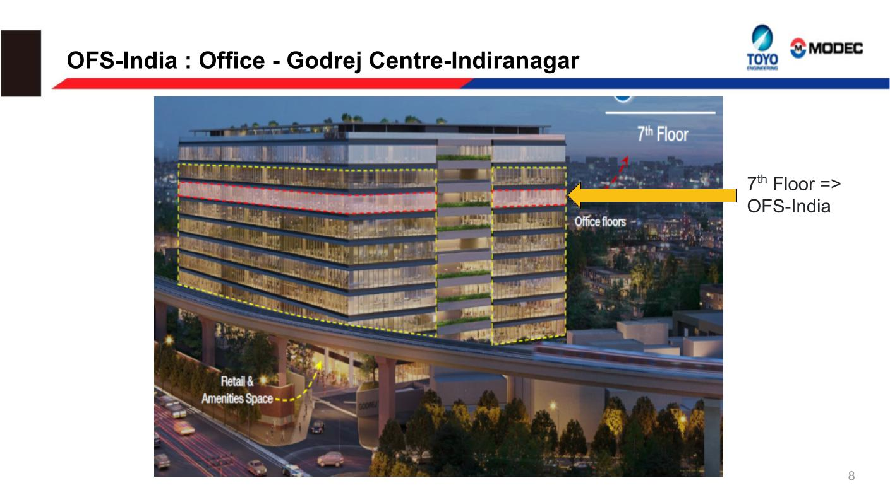

 <!-- New Location Section -->
      
      </head>

      <body>
        

          

            <h1 class="display-4 fw-bold mb-4" style="color: black; text-shadow: 2px 2px 4px rgba(0,0,0,0.3);">Our Office Location</h1>
          

        

        

          

            

            
             
            
              

                

                  
                

                <!-- 

                    <h4 class="portfolio__title"><a href="#">Highway Energy Station</a></h4>
                    

                      <a href="#">Analystics</a><a href="#">Optimization</a>
                    

                  
 -->
              
<!-- /.portfolio-item -->
             
              

                

                  
                

                <!-- 

                    <h4 class="portfolio__title"><a href="#">Highway Energy Station</a></h4>
                    

                      <a href="#">Analystics</a><a href="#">Optimization</a>
                    

                  
 -->
              
<!-- /.portfolio-item -->
              

                

                  
                

                <!-- 

                    <h4 class="portfolio__title"><a href="#">Highway Energy Station</a></h4>
                    

                      <a href="#">Analystics</a><a href="#">Optimization</a>
                    

                  
 -->
              
<!-- /.portfolio-item -->
              

                

                  
                

                <!-- 

                    <h4 class="portfolio__title"><a href="#">Highway Energy Station</a></h4>
                    

                      <a href="#">Analystics</a><a href="#">Optimization</a>
                    

                  
 -->
              
<!-- /.portfolio-item -->
             
             
            
<!-- /.carousel -->
          

        

        <!-- 

          

            

              
            

            

              
            

            

              
            

            

              
            

          

        
 -->

        <!-- New location Section Ends -->
        <!-- CTA SECTION ENDED -->
        <!-- ========================
      About Layout 2
    =========================== -->
        <link href="https://stackpath.bootstrapcdn.com/bootstrap/4.5.2/css/bootstrap.min.css" rel="stylesheet">

        

        <section class="business-section">
          <h2>FPSO Business</h2>
          <!-- 
Global Leading Player in Connecting Ocean and Humanity
 -->

          

            

              <!-- Card 1 -->
              

                

                  
                  <h4>FEED Execution</h4>
                

              

              <!-- Card 2 -->
              

                

                  
                  <h4>Detailed Engineering</h4>
                

              

              <!-- Card 3 -->
              

                

                  
                  <h4>Procurement Support</h4>
                

              

            

          

        </section>

        <!-- Add Bootstrap JS and dependencies -->
        
        
        

<!-- Footer CODe -->
        <footer id="footer" class="footer">
          

            

              

                

                  <h6 class="footer__widget-title">Quick Contact</h6>
                  

                    
If you have any questions or need help, feel free to contact with our team.

                    

                      <i class="icon-phone"></i>
                    

                    <ul class="social__icons">
                      <li><a href="#"><i class="fa fa-facebook"></i></a></li>
                      <li><a href="#"><i class="fa fa-instagram"></i></a></li>
                      <li><a href="#"><i class="fa fa-twitter"></i></a></li>
                    </ul><!-- /.social-icons -->
                  

                
<!-- /.col-xl-3 -->
                

                  <h6 class="footer__widget-title">Company</h6>
                  

                    <!-- <nav>
                      <ul class="list-unstyled">
                        <li><a href="#">About Us</a></li>
                        <li><a href="#">Meet Our Team</a></li>
                        <li><a href="#">News & Media</a></li>
                        <li><a href="#">Case Studies</a></li>
                        <li><a href="#">Contacts</a></li>
                        <li><a href="#">Careers</a></li>
                      </ul>
                    </nav> -->
                  
<!-- /.footer-widget-content -->
                
<!-- /.col-xl-2 -->
                

                  <h6 class="footer__widget-title">Industries</h6>
                  

                    <!-- <nav>
                      <ul class="list-unstyled">
                        <li><a href="#">Retail & Consumer</a></li>
                        <li><a href="#">Sciences & Healthcare</a></li>
                        <li><a href="#">Industrial & Chemical</a></li>
                        <li><a href="#">Power Generation</a></li>
                        <li><a href="#">Food & Beverage</a></li>
                        <li><a href="#">Oil & Gas</a></li>
                      </ul>
                    </nav> -->
                  
<!-- /.footer-widget-content -->
                
<!-- /.col-xl-2 -->
                

                  

                    
Sign up for industry alerts, our latest news, thoughts, and insights from OFS India.

                    <form class="widget__newsletter-form">
                      

                        <input type="text" class="form-control" placeholder="Your Email Address">
                        <button type="submit" class="btn btn__primary btn__hover2">
                          <i class="icon-arrow-right"></i>
                        </button>
                      

                    </form>
                  
<!-- /.footer-widget-content -->
                  <!-- 
You may withdraw your consent at any time!
 -->
                
<!-- /.col-xl-4 -->
              
<!-- /.row -->
            
<!-- /.container -->
          
<!-- /.footer-top -->
          

            

              

                

                  
                

                <!-- /.col-lg-3 -->
                

                  

                    <nav>
                      <ul class="footer__copyright-links list-unstyled d-flex flex-wrap justify-content-end">
                        <li><a href="#">Terms & Conditions </a></li>
                        <li><a href="#">Privacy Policy</a></li>
                        <li><a href="#">Sitemap</a></li>
                      </ul>
                    </nav>

                  
<!-- /.Footer-copyright -->
                
<!-- /.col-lg-9 -->
              
<!-- /.row -->
            
<!-- /.container -->
          
<!-- /.Footer-bottom -->
        </footer><!-- /.Footer -->